# OptimIEra

> **Optimize. Evaluate. Verify.**
>
> Make every AI instruction clearer, safer, more consistent, and easier to trust.


OptimIEra is a verifiable prompt-intelligence workspace. It transforms a rough instruction into an analyzed, scored, optimized, versioned, and provable prompt asset—so people can spend less time rewriting prompts and more time creating meaningful results.

## See OptimIEra in action

### A calmer, clearer way to work with AI

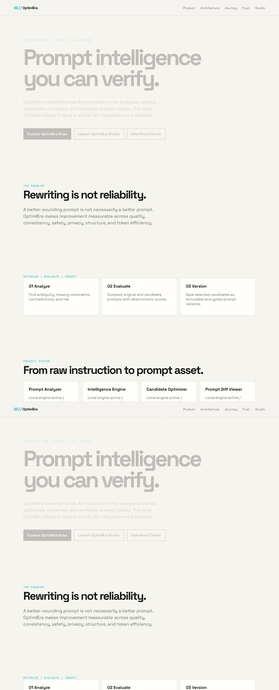

### One workspace for prompt reliability

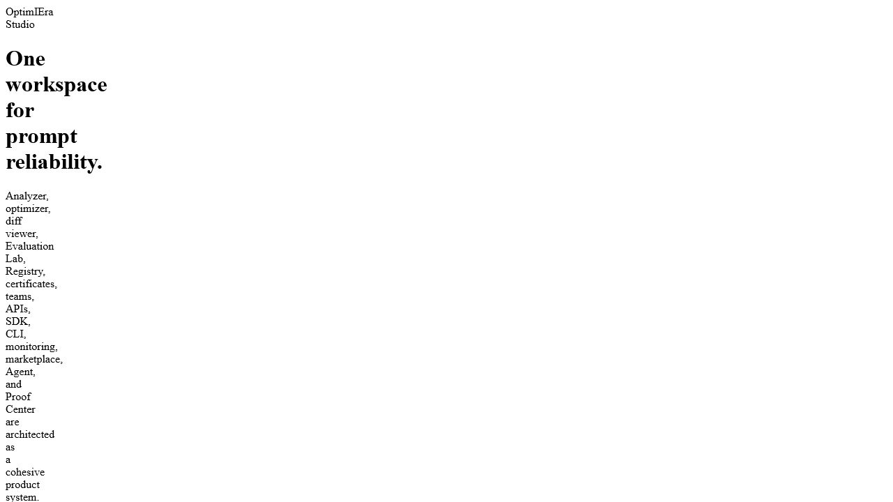

### Architecture designed around trust

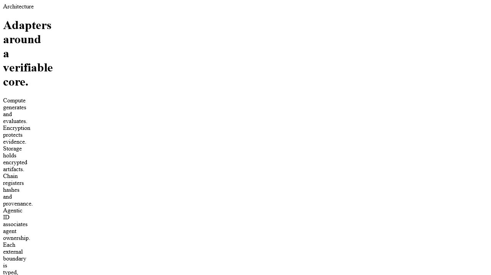

### A product journey built for steady progress

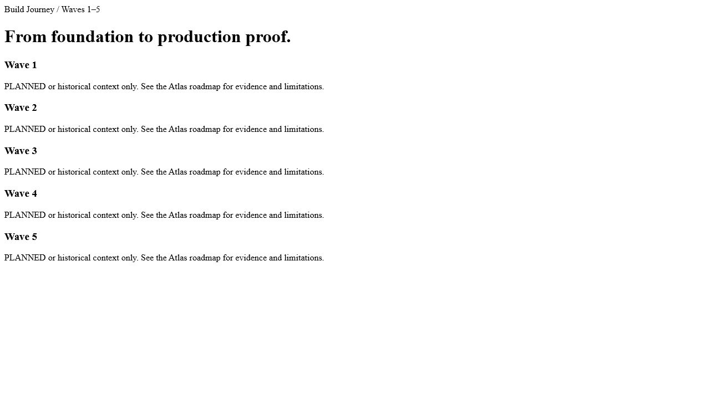

### Privacy and security at the center

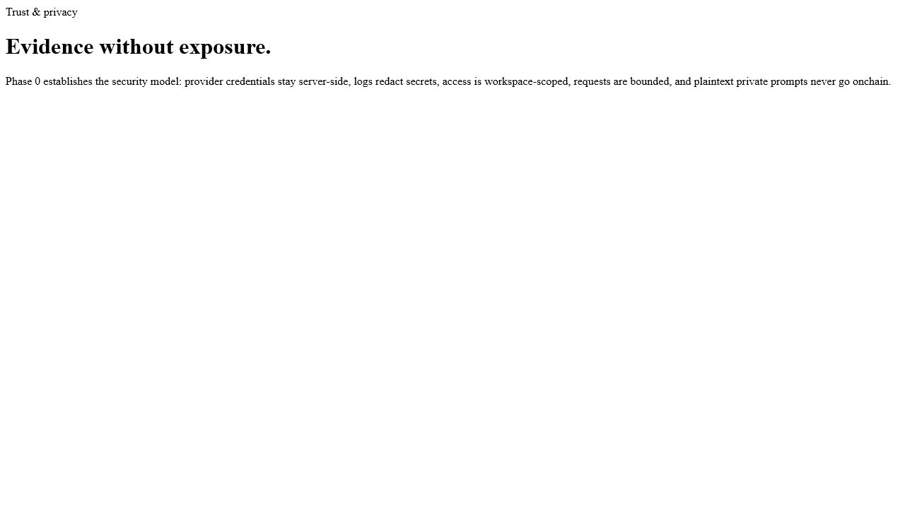

### Proof you can understand and share


### Friendly access for every kind of builder


## Live local product tour

These screenshots were captured from the real running local frontend at `http://localhost:3000` on 2026-07-19. They show the current UI—not mockups—including the public product story, wallet access, trust surfaces, and provider status.

| Surface                      | Real UI capture                                                   |
| ---------------------------- | ----------------------------------------------------------------- |
| Homepage                     | 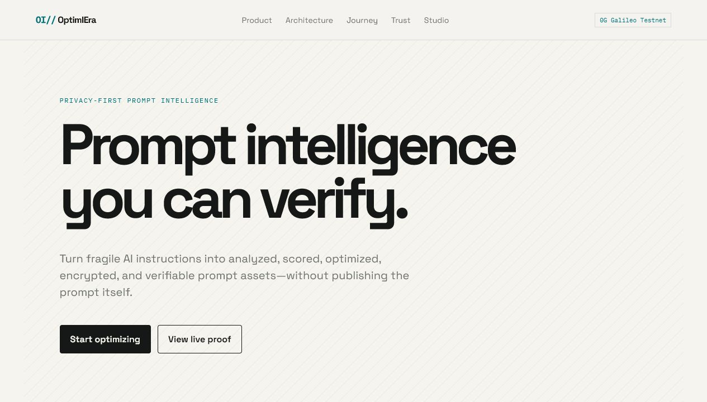    |
| Product vision               | 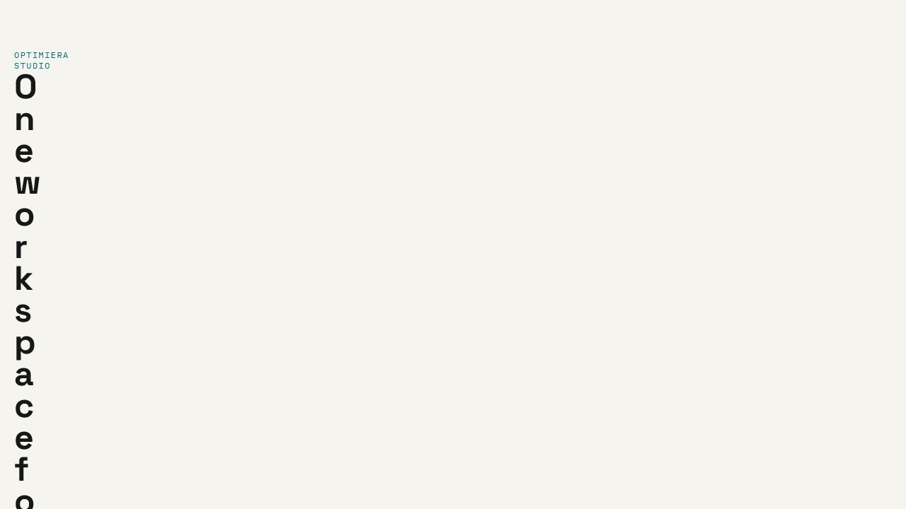         |
| Architecture                 | 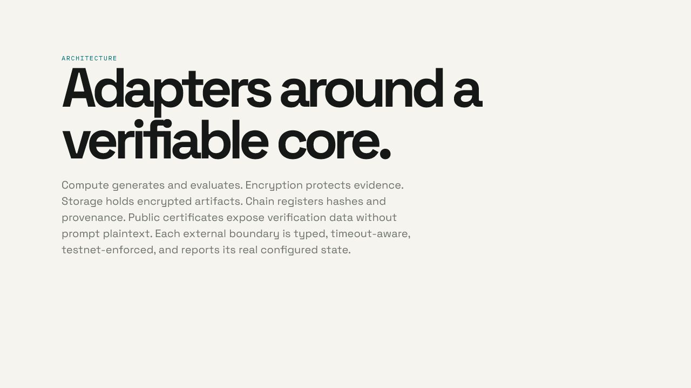      |
| Sign in                      | 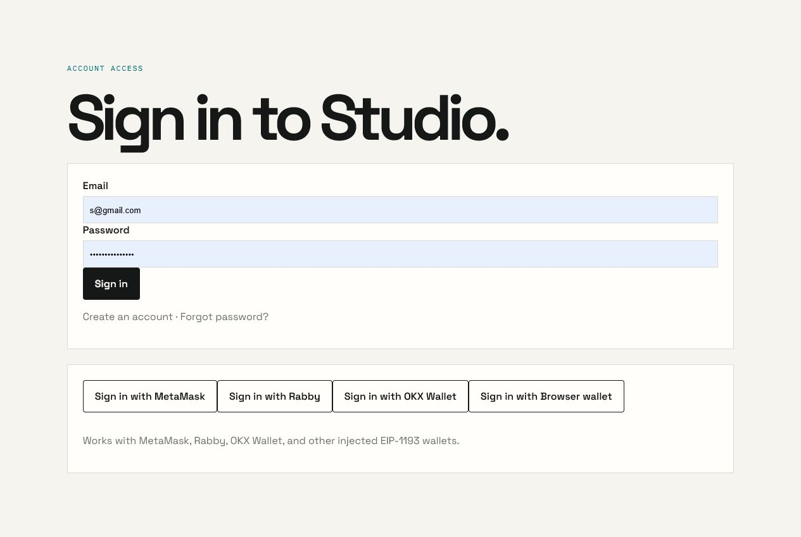         |
| Wallet registration          | 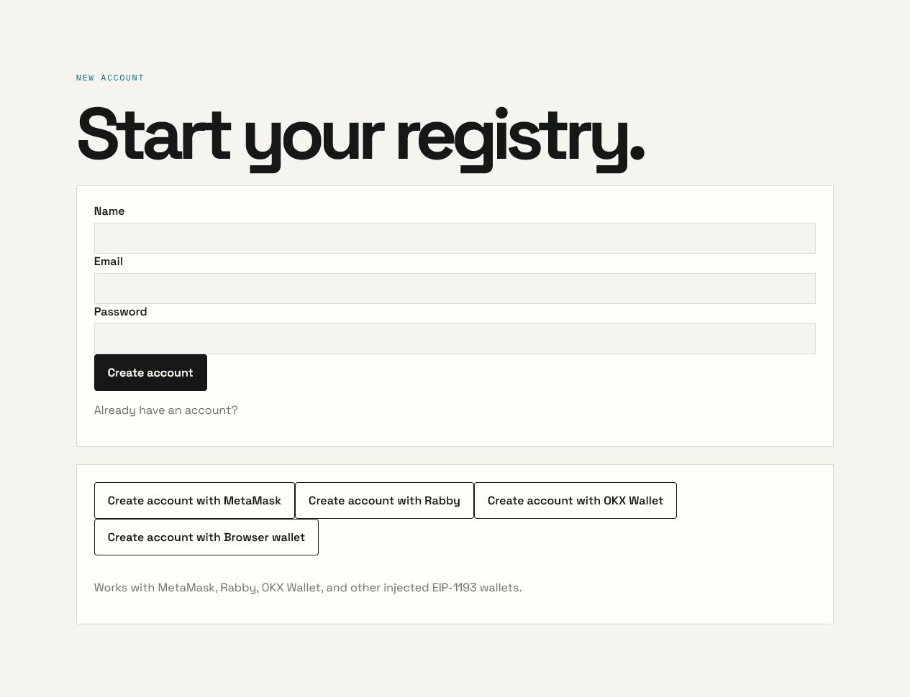    |
| Proof Center                 | 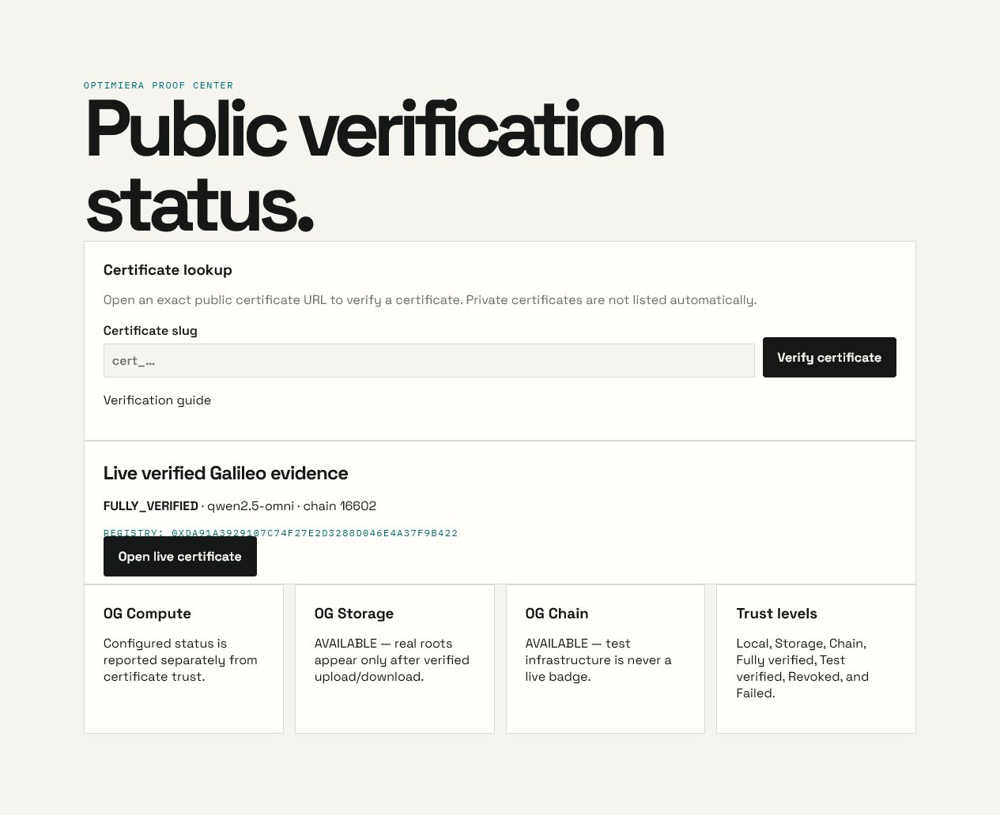            |
| Security                     | 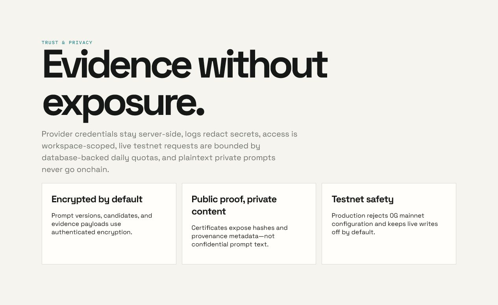         |
| Optimize and provider status | 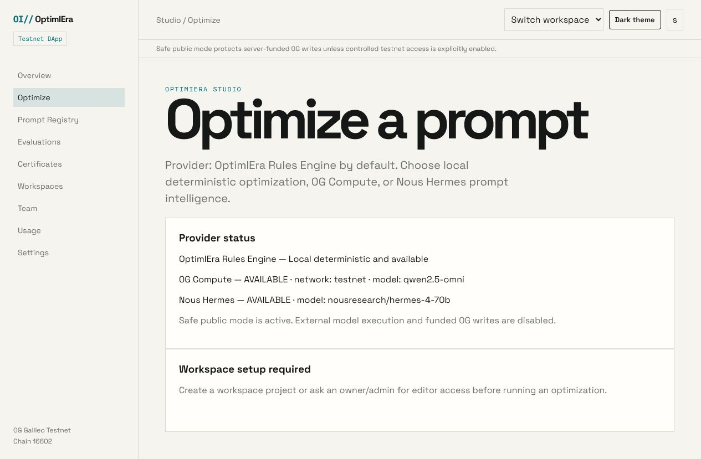 |

The wallet screens visibly offer MetaMask, Rabby, OKX Wallet, and other injected EIP-1193 wallets. The Optimize screen visibly reports the local Rules Engine, 0G Compute model/network, and Nous model status without exposing credentials.

## Why OptimIEra matters in daily life

AI is becoming part of ordinary life: writing messages, planning projects, learning new skills, researching ideas, preparing presentations, designing products, and automating repetitive work. The quality of the instruction often determines the quality of the result.

OptimIEra brings confidence to that everyday moment when someone thinks, “I know what I want—how do I explain it clearly?”

With OptimIEra, a student can turn a vague study request into a focused learning plan. A founder can make product research more structured. A designer can preserve the best version of a creative brief. A team can share reliable instructions instead of passing around scattered text. A developer can compare revisions and understand exactly what improved.

The result is a more thoughtful relationship with AI: clearer questions, better answers, stronger repeatability, and evidence that helps people learn from every iteration.

## The OptimIEra experience

1. **Analyze** — discover ambiguity, missing constraints, contradictions, safety concerns, privacy risks, and structural opportunities.
2. **Evaluate** — measure quality, consistency, safety, privacy, structure, and token efficiency with transparent scoring.
3. **Optimize** — generate three distinct directions: Balanced, Accuracy-focused, and Token-efficient.
4. **Compare** — see the difference between the original and each candidate with a readable prompt diff.
5. **Version** — save the chosen candidate as an immutable encrypted prompt version.
6. **Verify** — create evidence, certificates, and public proof without exposing private prompt content.

## Benefits

- **Clarity:** turn half-formed ideas into precise instructions.
- **Consistency:** reuse prompt assets that behave predictably across projects and teams.
- **Confidence:** understand why a candidate is recommended instead of accepting a mysterious rewrite.
- **Speed:** reduce repetitive prompt editing and move from idea to useful output faster.
- **Learning:** see which constraints, structure, and wording make an instruction stronger.
- **Privacy:** protect private prompt content with encrypted storage boundaries.
- **Collaboration:** organize prompts, projects, reviews, workspaces, and certificates in one place.
- **Proof:** preserve a verifiable record of what changed and why it matters.
- **Freedom:** use the local deterministic Rules Engine without depending on external AI credentials.

## Technology and why it helps

| Technology          | Role in OptimIEra                   | Benefit                                                                                                 |
| ------------------- | ----------------------------------- | ------------------------------------------------------------------------------------------------------- |
| Next.js + React     | Studio web application              | Fast, modern user experiences with server-rendered routes                                               |
| TypeScript          | Shared application language         | Safer refactoring and clearer contracts across the system                                               |
| pnpm + Turborepo    | Monorepo and build orchestration    | Efficient development across apps and reusable packages                                                 |
| PostgreSQL + Prisma | Durable product data                | Reliable persistence for workspaces, prompts, versions, reviews, and evidence                           |
| AES-256-GCM         | Prompt and candidate encryption     | Strong confidentiality and tamper detection for private content                                         |
| Better Auth + SIWE  | Account and wallet access           | Familiar email/password access plus compatible injected wallets such as MetaMask, Rabby, and OKX Wallet |
| Vitest + Playwright | Automated quality assurance         | Confidence from unit, integration, and browser workflow testing                                         |
| 0G Compute          | Optional model-assisted inference   | Verifiable decentralized compute when configured                                                        |
| 0G Storage          | Optional encrypted evidence storage | Durable decentralized evidence with proof-aware retrieval                                               |
| 0G Chain            | Optional provenance registry        | Hash-only onchain commitments that preserve privacy                                                     |
| Foundry + Solidity  | Registry contract tooling           | Reproducible contract formatting, builds, tests, and verification workflows                             |
| Docusaurus          | OptimIEra Atlas documentation       | A welcoming, searchable home for developers and contributors                                            |

## System flow

```text
Raw instruction
      ↓
Analyzer + safety/privacy findings
      ↓
Deterministic scoring
      ↓
Three optimized candidates
      ↓
Evaluation + recommendation + diff
      ↓
Encrypted immutable version
      ↓
Evidence manifest + certificate + optional 0G proof
```

## Current implementation

OptimIEra’s testnet product implementation is complete and is undergoing final managed-database deployment verification. The current workspace includes:

- complete local Studio optimization workflow;
- deterministic analyzer, scoring, candidates, comparison, recommendation, and diff;
- encrypted prompt, candidate, and evidence persistence;
- workspace, team, project, review, audit, registry, and certificate flows;
- email/password authentication and SIWE wallet authentication;
- 0G Compute Router model discovery and structured inference;
- encrypted 0G Storage evidence integration;
- hash-only 0G Chain registry commitments;
- public certificate verification and Proof Center;
- authenticated Galileo testnet proof flow with a `FULLY_VERIFIED` certificate;
- wallet-approved Galileo usage payment flow at exactly `0.0001 0G` per enabled optimization, with receipt and replay validation;
- APIs, SDK, CLI, monitoring boundaries, and developer documentation.

The local safe profile keeps funded 0G writes and usage payments disabled. Nous and 0G Compute are configured and verified locally, while external execution is explicit and never silently replaces the Rules Engine.

## Run OptimIEra locally

### Requirements

- Node.js 24+
- pnpm 11+
- Docker Desktop
- PostgreSQL through the included Docker Compose setup

### Windows PowerShell

```powershell
pnpm install
Copy-Item .env.example .env
docker compose up -d postgres
pnpm db:migrate:deploy
pnpm dev
```

Open [http://localhost:3000](http://localhost:3000).

For local encrypted storage, configure `OPTIMIERA_ENCRYPTION_MASTER_KEY` and keep `PROMPT_STORAGE_MODE` aligned with the environment. Never place production secrets in source control.

## Easy Vercel deployment

1. Create separate managed PostgreSQL databases for **Preview** and **Production** in Vercel. If Vercel asks you to accept Neon Marketplace terms, the account owner must approve them once.
2. Import this repository into Vercel and set **Root Directory** to `apps/web`.
3. Use Node.js 24.x, install command `cd ../.. && pnpm install --frozen-lockfile`, and build command `cd ../.. && pnpm vercel-build`.
4. Add the required environment variables from [the Vercel environment matrix](docs/deployment/VERCEL_ENVIRONMENT_MATRIX.md). Keep secrets server-only, use HTTPS auth URLs, and keep all 0G networks on Galileo testnet (`16602`).
5. Apply migrations through the build command, deploy Preview, and test sign-up, wallet access, Studio optimization, Proof Center, and mobile navigation.
6. Repeat with Production variables only after Preview passes. Check `/api/health` and `/api/readiness` before sharing the URL.

Never put `.env`, private keys, API keys, or database URLs in Git or browser-exposed variables. Do not run live 0G writes until funded testnet credentials and an explicit activation decision are available.

## Quality gates

```powershell
pnpm format:check
pnpm lint
pnpm typecheck
pnpm test
pnpm test:e2e
pnpm docs:build
pnpm web:build
pnpm build
pnpm safety:scan
```

The project is prepared for Vercel deployment as a pnpm monorepo. Configure `apps/web` as the Vercel project root, install with `pnpm install --frozen-lockfile`, and use `cd ../.. && pnpm vercel-build`. Preview and Production require separate managed PostgreSQL databases. See [Vercel deployment](docs/deployment/VERCEL_DEPLOYMENT.md).

## Privacy promise

OptimIEra is designed so private prompt content can remain private. Prompt bodies, candidate bodies, and evidence payloads use encrypted storage boundaries. Public provenance uses hashes and safe metadata rather than publishing confidential instructions. This lets people gain trust and accountability without sacrificing ownership of their ideas.

## Roadmap

After production closure, the next isolated scope is operational hardening: managed backup drills, observability, quota tuning, and support runbooks. Mainnet, Agentic ID, marketplace expansion, and data availability remain outside this release.

## Documentation

- [Implementation status](docs/IMPLEMENTATION_STATUS.md)
- [Security model](docs/SECURITY_MODEL.md)
- [Known limitations](docs/KNOWN_LIMITATIONS.md)
- [Testing strategy](docs/TEST_STRATEGY.md)
- [Official 0G sources](docs/OFFICIAL_0G_SOURCES.md)
- [OptimIEra Atlas source](apps/docs)

## License

OptimIEra is released under the MIT License.

Built with care for people who want AI to feel more useful, more understandable, and more trustworthy. 💙
