# Verified OptimIEra Asset Architecture

## Trust boundary

OptimIEra has two intentionally different outcomes:

- **Local Optimization**: the deterministic Rules Engine can analyze, optimize,
  evaluate, and persist encrypted immutable versions without blockchain activity.
- **Verified OptimIEra Asset**: a stronger product state that cannot exist without
  0G Storage verification and a confirmed 0G Chain commitment. Test adapters and
  local evidence never qualify.

## Canonical pipeline

```mermaid
flowchart LR
  A[Prompt] --> B[Privacy and safety preprocessing]
  B --> C[Analyzer]
  C --> D[Optimization]
  D --> E[Evaluation]
  E --> F[Immutable PromptVersion]
  F --> G[Canonical EvidenceManifest]
  G --> H[Encrypt evidence]
  H --> I[0G Storage upload]
  I --> J[Storage proof and hash readback]
  J --> K[0G Chain commitment]
  K --> L[Receipt and contract readback]
  L --> M[OptimIEra Certificate]
```



The public chain commitment contains hashes and safe metadata only. Prompt
plaintext is never placed on-chain.

## Canonical state machine

```text
DRAFT → ANALYZED → OPTIMIZED → VERSIONED → EVIDENCE_CREATED
      → STORAGE_PENDING → STORAGE_VERIFIED
      → CHAIN_PENDING → CHAIN_CONFIRMED → VERIFIED
                                      ↘ REVOKED
Any active state may enter FAILED when an operation fails.
```

The transition table is implemented in `@optimiera/schemas` by
`transitionVerificationState`. Invalid jumps, including `DRAFT → VERIFIED`,
`CHAIN_CONFIRMED → STORAGE_VERIFIED`, and `REVOKED → VERIFIED`, are rejected.

## Centralized verification service

`apps/web/src/lib/verification-service.ts` is the single application service for
deriving trust state and projecting `VerifiedPromptAsset`. Certificate issuance
calls `assertVerifiedAsset`, which requires:

1. a saved immutable PromptVersion;
2. a `DOWNLOAD_VERIFIED` 0G Storage artifact with root and content hash;
3. a non-test Chain proof with a successful transaction hash;
4. no revoked or failed terminal state.

The projection exposes only hashes, IDs, roots, transaction references, chain
metadata, evaluation version, and timestamps. It does not expose prompt plaintext.

## Reused persistence

| Domain concern                      | Existing record           |
| ----------------------------------- | ------------------------- |
| Prompt and immutable version        | `Prompt`, `PromptVersion` |
| Canonical evidence and Storage root | `Artifact`                |
| Chain commitment and readback       | `ChainProof`              |
| Public certificate                  | `Certificate`             |

`VerifiedPromptAsset` is a canonical domain projection over these records, so
the trust path does not create a parallel database or adapter implementation.

## Runtime modes

- `LOCAL`: safe Rules Engine and test-only adapters; never a Verified Asset.
- `GALILEO_LIVE`: real Galileo Storage/Chain operations when configured and
  live writes are enabled.
- `MAINNET`: reserved for a future phase and rejected by the Galileo activation
  path.
